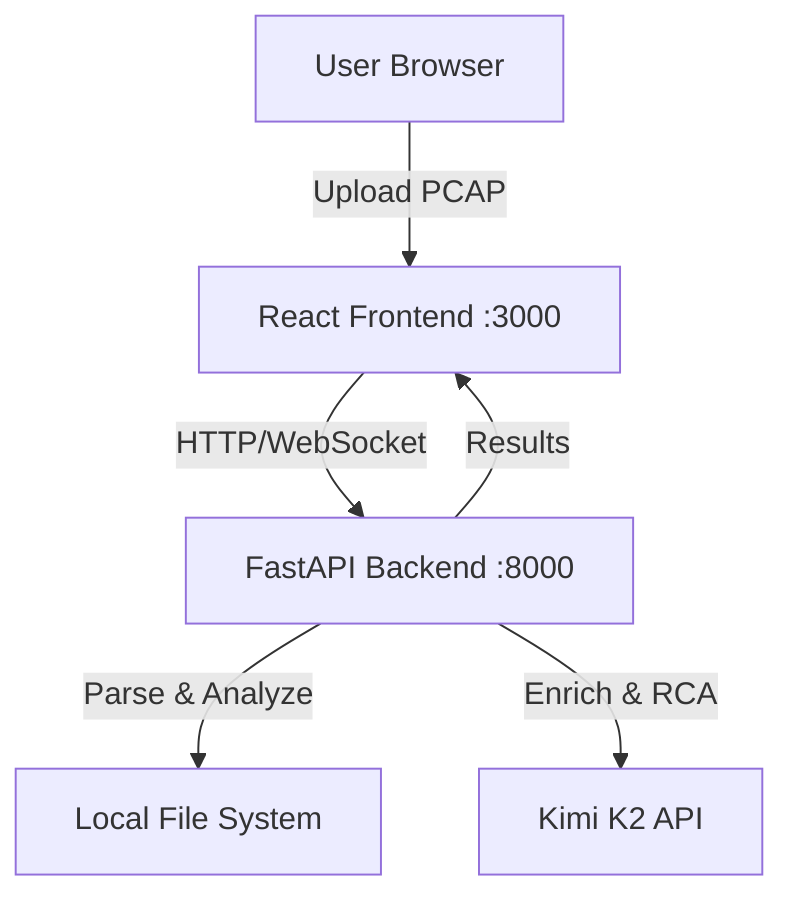

# Telecom PCAP Analyzer - Simple POC Implementation Plan

## Overview
A simplified single-user proof-of-concept PCAP analyzer with 5G protocol support and Kimi K2 LLM integration.

## Architecture (Simplified)



## Technology Stack (Minimal)

**Backend:**
- Python 3.11+ with FastAPI
- Scapy for PCAP parsing
- OpenAI SDK for Kimi K2
- SQLite for simple data storage
- In-memory async processing (no Celery)

**Frontend:**
- React 18 with JavaScript (no TypeScript for simplicity)
- Recharts for visualization
- Basic CSS (no Tailwind, or simple Tailwind CDN)
- Fetch API (no Axios)

**Deployment:**
- Run locally with `python` and `npm start`
- Optional: Simple Docker Compose (2 containers only)

## Simplified Project Structure

```
pcap/
├── backend/
│   ├── app/
│   │   ├── main.py                  # FastAPI app (all-in-one)
│   │   ├── pcap_parser.py           # PCAP parsing
│   │   ├── telecom_analyzer.py      # Protocol analysis
│   │   ├── llm_service.py           # Kimi K2 integration
│   │   └── models.py                # Simple data models
│   ├── uploads/                     # Store uploaded files
│   ├── results/                     # Store analysis results
│   ├── requirements.txt
│   └── .env
├── frontend/
│   ├── public/
│   ├── src/
│   │   ├── App.js                   # Main component
│   │   ├── FileUpload.js
│   │   ├── Dashboard.js
│   │   ├── ProgressBar.js
│   │   └── RootCauseAnalysis.js
│   ├── package.json
│   └── index.html
├── docker-compose.yml               # Optional
└── README.md
```

## Configuration

**backend/.env:**
```bash
KIMI_API_KEY=sk-hoqYoPzDtlLikV7B598BHQC9CNaous1DU9ObtTUibITMtJBf
KIMI_API_BASE_URL=https://api.moonshot.ai/v1
KIMI_MODEL=kimi-k2-turbo-preview
MAX_FILE_SIZE_MB=500
```

## Implementation Details

### Backend (backend/app/main.py)

**Single-file FastAPI application with all endpoints:**

```python
from fastapi import FastAPI, File, UploadFile, WebSocket
from fastapi.middleware.cors import CORSMiddleware
from fastapi.responses import JSONResponse
import asyncio
import json
import uuid
from pathlib import Path
from pcap_parser import parse_pcap
from telecom_analyzer import analyze_flows
from llm_service import enrich_with_llm, root_cause_analysis

app = FastAPI()

# CORS for frontend
app.add_middleware(
    CORSMiddleware,
    allow_origins=["http://localhost:3000"],
    allow_methods=["*"],
    allow_headers=["*"],
)

# In-memory storage for POC
analyses = {}
active_connections = {}

@app.post("/api/upload")
async def upload_pcap(file: UploadFile = File(...)):
    """Upload and analyze PCAP file"""
    job_id = str(uuid.uuid4())
    
    # Save file
    file_path = Path(f"uploads/{job_id}_{file.filename}")
    file_path.parent.mkdir(exist_ok=True)
    
    content = await file.read()
    file_path.write_bytes(content)
    
    # Initialize analysis
    analyses[job_id] = {
        "status": "processing",
        "progress": 0,
        "filename": file.filename,
        "results": None
    }
    
    # Start async analysis
    asyncio.create_task(analyze_pcap(job_id, str(file_path)))
    
    return {"job_id": job_id}

async def analyze_pcap(job_id: str, file_path: str):
    """Async PCAP analysis"""
    try:
        # Update progress
        analyses[job_id]["progress"] = 10
        await broadcast_progress(job_id, 10, "Parsing PCAP...")
        
        # Parse PCAP
        packets = await asyncio.to_thread(parse_pcap, file_path)
        analyses[job_id]["progress"] = 40
        await broadcast_progress(job_id, 40, "Analyzing protocols...")
        
        # Analyze telecom protocols
        flows = await asyncio.to_thread(analyze_flows, packets)
        analyses[job_id]["progress"] = 60
        await broadcast_progress(job_id, 60, "Enriching with LLM...")
        
        # LLM enrichment
        enriched_flows = await enrich_with_llm(flows)
        analyses[job_id]["progress"] = 80
        await broadcast_progress(job_id, 80, "Root cause analysis...")
        
        # Root cause analysis
        rca = await root_cause_analysis(flows)
        
        # Store results
        results = {
            "flows": enriched_flows,
            "root_cause_analysis": rca,
            "summary": {
                "total_flows": len(flows),
                "total_packets": len(packets),
                "protocols": list(set(f["protocol"] for f in flows))
            }
        }
        
        analyses[job_id]["status"] = "completed"
        analyses[job_id]["progress"] = 100
        analyses[job_id]["results"] = results
        
        await broadcast_progress(job_id, 100, "Complete!")
        
    except Exception as e:
        analyses[job_id]["status"] = "failed"
        analyses[job_id]["error"] = str(e)
        await broadcast_progress(job_id, 0, f"Error: {str(e)}")

@app.get("/api/analysis/{job_id}")
async def get_analysis(job_id: str):
    """Get analysis results"""
    if job_id not in analyses:
        return JSONResponse({"error": "Job not found"}, status_code=404)
    return analyses[job_id]

@app.websocket("/ws/{job_id}")
async def websocket_endpoint(websocket: WebSocket, job_id: str):
    """WebSocket for progress updates"""
    await websocket.accept()
    active_connections[job_id] = websocket
    try:
        while True:
            await websocket.receive_text()
    except:
        if job_id in active_connections:
            del active_connections[job_id]

async def broadcast_progress(job_id: str, progress: int, message: str):
    """Send progress update via WebSocket"""
    if job_id in active_connections:
        try:
            await active_connections[job_id].send_json({
                "progress": progress,
                "message": message
            })
        except:
            pass
```

### Backend - PCAP Parser (backend/app/pcap_parser.py)

```python
from scapy.all import rdpcap, IP, TCP, UDP
from scapy.contrib.gtp import GTPHeader

def parse_pcap(file_path: str):
    """Parse PCAP file and extract packets"""
    packets = rdpcap(file_path)
    
    parsed_packets = []
    for pkt in packets:
        packet_info = {
            "timestamp": float(pkt.time),
            "length": len(pkt)
        }
        
        # Extract IP layer
        if pkt.haslayer(IP):
            packet_info["src_ip"] = pkt[IP].src
            packet_info["dst_ip"] = pkt[IP].dst
            packet_info["protocol"] = pkt[IP].proto
        
        # Extract transport layer
        if pkt.haslayer(TCP):
            packet_info["src_port"] = pkt[TCP].sport
            packet_info["dst_port"] = pkt[TCP].dport
            packet_info["transport"] = "TCP"
        elif pkt.haslayer(UDP):
            packet_info["src_port"] = pkt[UDP].sport
            packet_info["dst_port"] = pkt[UDP].dport
            packet_info["transport"] = "UDP"
        
        # Check for GTP-U
        if pkt.haslayer(GTPHeader):
            packet_info["gtp"] = {
                "teid": pkt[GTPHeader].teid if hasattr(pkt[GTPHeader], 'teid') else None
            }
        
        parsed_packets.append(packet_info)
    
    return parsed_packets
```

### Backend - LLM Service (backend/app/llm_service.py)

```python
from openai import OpenAI
import os
import json
from dotenv import load_dotenv

load_dotenv()

client = OpenAI(
    api_key=os.getenv("KIMI_API_KEY"),
    base_url=os.getenv("KIMI_API_BASE_URL")
)

# Simple in-memory cache
llm_cache = {}

async def enrich_with_llm(flows: list):
    """Enrich flows with LLM insights"""
    enriched = []
    
    # Only analyze top 5 flows for POC
    for flow in flows[:5]:
        flow_key = f"{flow['src_ip']}:{flow['dst_ip']}"
        
        if flow_key in llm_cache:
            flow["llm_insight"] = llm_cache[flow_key]
        else:
            prompt = f"""Analyze this 5G network flow:
Protocol: {flow.get('protocol', 'Unknown')}
Source: {flow['src_ip']}:{flow.get('src_port', 'N/A')}
Destination: {flow['dst_ip']}:{flow.get('dst_port', 'N/A')}
Packets: {flow['packet_count']}, Bytes: {flow['total_bytes']}

Provide a brief analysis (2-3 sentences) of what this flow represents."""
            
            try:
                completion = client.chat.completions.create(
                    model=os.getenv("KIMI_MODEL"),
                    messages=[
                        {"role": "system", "content": "You are a telecom network expert. Analyze network flows concisely."},
                        {"role": "user", "content": prompt}
                    ],
                    temperature=0.6,
                    max_tokens=200
                )
                
                insight = completion.choices[0].message.content
                flow["llm_insight"] = insight
                llm_cache[flow_key] = insight
            except Exception as e:
                flow["llm_insight"] = f"Error: {str(e)}"
        
        enriched.append(flow)
    
    return enriched

async def root_cause_analysis(flows: list):
    """Perform root cause analysis"""
    summary = {
        "total_flows": len(flows),
        "protocols": list(set(f.get("protocol", "Unknown") for f in flows))
    }
    
    prompt = f"""Analyze this network capture:
- Total Flows: {summary['total_flows']}
- Protocols: {', '.join(summary['protocols'])}

Sample flows:
{json.dumps(flows[:3], indent=2)}

Provide:
1. Overall assessment (1-2 sentences)
2. Top 2-3 potential issues or observations
3. Recommendations (if any)

Keep response under 200 words."""
    
    try:
        completion = client.chat.completions.create(
            model=os.getenv("KIMI_MODEL"),
            messages=[
                {"role": "system", "content": "You are a telecom network expert specializing in 5G. Provide concise root cause analysis."},
                {"role": "user", "content": prompt}
            ],
            temperature=0.6,
            max_tokens=300
        )
        
        return completion.choices[0].message.content
    except Exception as e:
        return f"RCA unavailable: {str(e)}"
```

### Backend - Telecom Analyzer (backend/app/telecom_analyzer.py)

```python
from collections import defaultdict

def analyze_flows(packets: list):
    """Aggregate packets into flows"""
    flows_dict = defaultdict(lambda: {
        "packet_count": 0,
        "total_bytes": 0,
        "timestamps": []
    })
    
    for pkt in packets:
        if "src_ip" not in pkt or "dst_ip" not in pkt:
            continue
        
        # Create flow key
        flow_key = (
            pkt["src_ip"],
            pkt["dst_ip"],
            pkt.get("src_port", 0),
            pkt.get("dst_port", 0),
            pkt.get("transport", "Unknown")
        )
        
        flow = flows_dict[flow_key]
        flow["packet_count"] += 1
        flow["total_bytes"] += pkt["length"]
        flow["timestamps"].append(pkt["timestamp"])
        
        # Store flow identifiers
        flow["src_ip"] = pkt["src_ip"]
        flow["dst_ip"] = pkt["dst_ip"]
        flow["src_port"] = pkt.get("src_port", 0)
        flow["dst_port"] = pkt.get("dst_port", 0)
        flow["protocol"] = pkt.get("transport", "Unknown")
        
        # GTP info if present
        if "gtp" in pkt:
            flow["gtp"] = pkt["gtp"]
    
    # Calculate metrics
    flows = []
    for flow in flows_dict.values():
        if flow["timestamps"]:
            flow["duration"] = max(flow["timestamps"]) - min(flow["timestamps"])
            flow["start_time"] = min(flow["timestamps"])
            flow["end_time"] = max(flow["timestamps"])
        
        # Remove timestamps from output
        del flow["timestamps"]
        flows.append(flow)
    
    # Sort by packet count
    flows.sort(key=lambda x: x["packet_count"], reverse=True)
    
    return flows
```

### Frontend (frontend/src/App.js)

```javascript
import React, { useState } from 'react';
import FileUpload from './FileUpload';
import ProgressBar from './ProgressBar';
import Dashboard from './Dashboard';
import './App.css';

function App() {
  const [jobId, setJobId] = useState(null);
  const [analysisData, setAnalysisData] = useState(null);
  const [progress, setProgress] = useState(0);
  const [stage, setStage] = useState('');

  const handleUploadComplete = (id) => {
    setJobId(id);
    connectWebSocket(id);
  };

  const connectWebSocket = (id) => {
    const ws = new WebSocket(`ws://localhost:8000/ws/${id}`);
    
    ws.onmessage = (event) => {
      const data = JSON.parse(event.data);
      setProgress(data.progress);
      setStage(data.message);
      
      if (data.progress === 100) {
        fetchResults(id);
        ws.close();
      }
    };
    
    ws.onerror = () => {
      setTimeout(() => fetchResults(id), 2000);
    };
  };

  const fetchResults = async (id) => {
    try {
      const response = await fetch(`http://localhost:8000/api/analysis/${id}`);
      const data = await response.json();
      if (data.status === 'completed') {
        setAnalysisData(data.results);
      }
    } catch (error) {
      console.error('Error fetching results:', error);
    }
  };

  return (
    <div className="App">
      <header>
        <h1>Telecom PCAP Analyzer</h1>
        <p>5G Protocol Analysis with AI-Powered Insights</p>
      </header>
      
      <main>
        {!jobId && <FileUpload onUploadComplete={handleUploadComplete} />}
        
        {jobId && !analysisData && (
          <ProgressBar progress={progress} stage={stage} />
        )}
        
        {analysisData && <Dashboard data={analysisData} />}
      </main>
    </div>
  );
}

export default App;
```

### Frontend - File Upload (frontend/src/FileUpload.js)

```javascript
import React, { useState } from 'react';

function FileUpload({ onUploadComplete }) {
  const [file, setFile] = useState(null);
  const [uploading, setUploading] = useState(false);
  const [dragOver, setDragOver] = useState(false);

  const handleDrop = (e) => {
    e.preventDefault();
    setDragOver(false);
    
    const droppedFile = e.dataTransfer.files[0];
    if (droppedFile && (droppedFile.name.endsWith('.pcap') || droppedFile.name.endsWith('.pcapng'))) {
      setFile(droppedFile);
    } else {
      alert('Please upload a .pcap or .pcapng file');
    }
  };

  const handleFileSelect = (e) => {
    const selectedFile = e.target.files[0];
    if (selectedFile) {
      setFile(selectedFile);
    }
  };

  const handleUpload = async () => {
    if (!file) return;
    
    setUploading(true);
    const formData = new FormData();
    formData.append('file', file);
    
    try {
      const response = await fetch('http://localhost:8000/api/upload', {
        method: 'POST',
        body: formData,
      });
      
      const data = await response.json();
      onUploadComplete(data.job_id);
    } catch (error) {
      alert('Upload failed: ' + error.message);
      setUploading(false);
    }
  };

  return (
    <div className="upload-container">
      <div 
        className={`drop-zone ${dragOver ? 'drag-over' : ''}`}
        onDrop={handleDrop}
        onDragOver={(e) => { e.preventDefault(); setDragOver(true); }}
        onDragLeave={() => setDragOver(false)}
      >
        {file ? (
          <div>
            <p>Selected: {file.name}</p>
            <p>Size: {(file.size / 1024 / 1024).toFixed(2)} MB</p>
          </div>
        ) : (
          <div>
            <p>Drop PCAP file here or</p>
            <input 
              type="file" 
              id="file-input"
              accept=".pcap,.pcapng"
              onChange={handleFileSelect}
              style={{ display: 'none' }}
            />
            <label htmlFor="file-input" className="browse-btn">
              Browse Files
            </label>
          </div>
        )}
      </div>
      
      {file && !uploading && (
        <button onClick={handleUpload} className="upload-btn">
          Analyze PCAP
        </button>
      )}
      
      {uploading && <p>Uploading...</p>}
    </div>
  );
}

export default FileUpload;
```

## Dependencies

**backend/requirements.txt:**
```
fastapi==0.104.0
uvicorn[standard]==0.24.0
scapy==2.5.0
python-multipart==0.0.6
python-dotenv==1.0.0
openai==1.12.0
websockets==12.0
```

**frontend/package.json:**
```json
{
  "name": "pcap-analyzer-frontend",
  "version": "1.0.0",
  "dependencies": {
    "react": "^18.2.0",
    "react-dom": "^18.2.0",
    "recharts": "^2.10.0"
  },
  "scripts": {
    "start": "react-scripts start",
    "build": "react-scripts build"
  }
}
```

## Running the Application

**Without Docker (Recommended for POC):**

```bash
# Backend
cd backend
pip install -r requirements.txt
python -m uvicorn app.main:app --reload --port 8000

# Frontend (in new terminal)
cd frontend
npm install
npm start
```

Access at: http://localhost:3000

**With Docker (Optional):**

```yaml
# docker-compose.yml
version: '3.8'

services:
  backend:
    build: ./backend
    ports:
      - "8000:8000"
    environment:
      - KIMI_API_KEY=${KIMI_API_KEY}
    volumes:
      - ./backend:/app

  frontend:
    build: ./frontend
    ports:
      - "3000:3000"
    depends_on:
      - backend
```

## Implementation Timeline

**Total: 3-5 days**

### Day 1: Backend Core
- Set up FastAPI with basic endpoints
- Implement PCAP parser with Scapy
- Test with sample PCAP file

### Day 2: LLM Integration & Analysis
- Integrate Kimi K2 API
- Implement flow analyzer
- Test enrichment and RCA

### Day 3: Frontend
- Create React app with upload component
- Implement WebSocket for progress
- Create basic dashboard

### Day 4-5: Polish & Testing
- Add visualization with Recharts
- Handle errors gracefully
- Test end-to-end flow
- Basic styling

## Key Simplifications

**Removed:**
- ❌ Celery/Redis (using async FastAPI instead)
- ❌ Database (using in-memory storage)
- ❌ Nginx (direct FastAPI serving)
- ❌ Complex Docker setup
- ❌ TypeScript (plain JavaScript)
- ❌ State management libraries
- ❌ Authentication/multi-user
- ❌ Advanced protocol parsers
- ❌ Comprehensive testing
- ❌ Production optimizations

**Kept:**
- ✅ FastAPI backend
- ✅ React frontend
- ✅ Scapy for PCAP parsing
- ✅ Kimi K2 LLM integration
- ✅ WebSocket progress updates
- ✅ Basic flow analysis
- ✅ Simple dashboard
- ✅ File upload

## Success Criteria (POC)

- ✅ Upload a PCAP file
- ✅ See real-time progress
- ✅ View parsed flows in dashboard
- ✅ See LLM-generated insights
- ✅ Get basic root cause analysis
- ✅ Complete analysis in < 5 minutes

## Notes

- All data is in-memory (lost on restart)
- Single user only
- Basic error handling
- No data persistence
- Suitable for demonstration/POC only
- For production, revisit the full implementation plan
